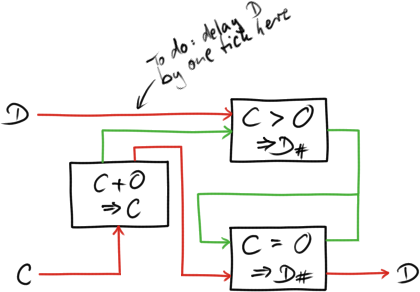
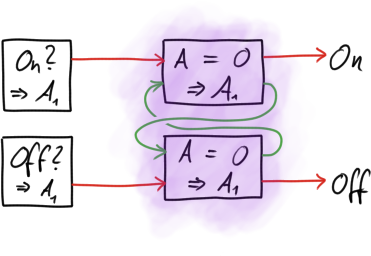
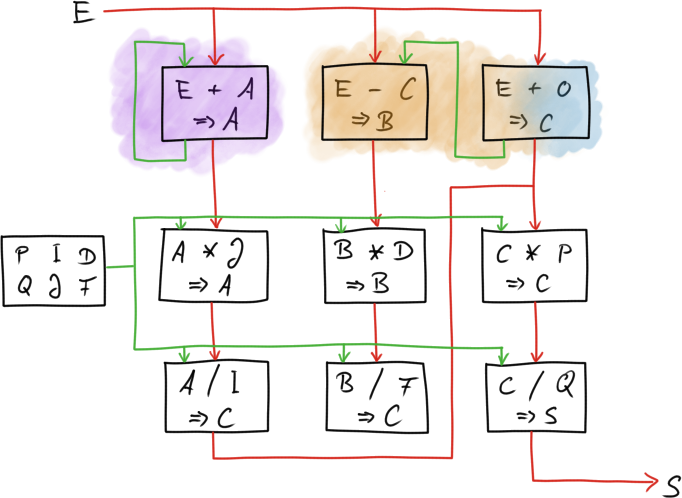
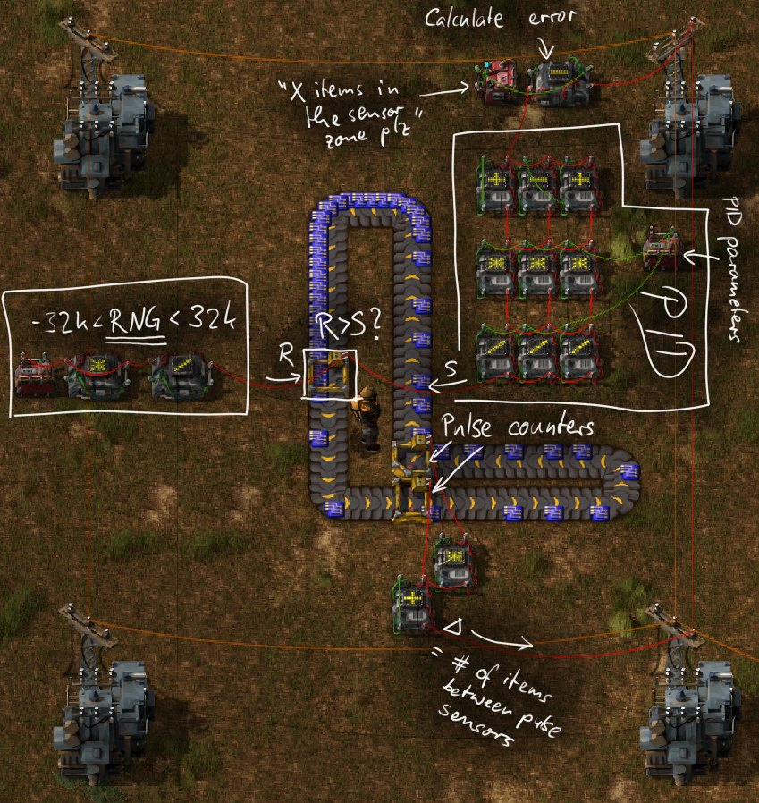

# Digital electronics components

## D latch

A D latch (for »data«) is a simple digital memory cell. It simply stores the
current value of the input signal when triggered, and holds it until the trigger
event (overwriting the previous one).

In Factorio, we have simpler ways of building memory cells, but they usually
have several shortcomings, such as no reset condition, and adding up signals
instead of overwriting the old value.

The standard digital D latch holds only a binary value, but in Factorio we can
build a simple D latch that can hold one arbitrary (analog) value, and is
triggered by a digital signal.

The schematic is as follows:

The memory cell consists of the two logical combinators on the right: when the
clock signal `C` is true, let the current value of `D` (`#` for »input count«)
into the green circuit through the top combinator. When `C` is false, then do
not read `D` from the input signal, but from the green loop instead. This way,
`C` switches the circuit from either retaining the stored signal, or forgetting
it and continuously reading it from the outside.

The NOOP combinator on the left separates the `C` and `D` signals, because D
must only enter the green loop from the top, and by my convention, all free
wires have to be red. Since this combinator introduces a 1-tick delay, we also
route the `C` signal to the bottom combinator through it so they stay in sync.

**TODO** Currently, C is one tick slower than than D, so that one should be
delayed as well.

## Shift register

**TODO:** combine multiple D latches to get a shift register. (The intermediate
`D+0` cleaning cells are unnecessary in this case.)

# Controllers

The purpose of a controller is automatically tweaking the parameters of a system
so that it follows certain rules. For example, a stove has a controller that
enables and disables the heating elements in a way that the desired temperature
is reached as fast as possible, and then maintained relatively constant.

## Schmitt trigger

The simplest controller worth the name is known as a »Schmitt Trigger« or »Bang
Bang Controller«: if the desired quantity (stove heat) is below a threshold
enable the input (current to the heater), if it’s above a threshold disable it
again.

The downside of the Schmitt trigger is that it makes a system oscillate between
the minimum and maximum state (when ideally it should be stable, not just
bounded), and it doesn’t adapt to new circumstances.

In Factorio, we can build a Schmitt trigger out of an RS latch (the purple
part),

The on and off conditions should be mutually exclusive, since RS Nor latches
have undefined behaviour when both inputs are enabled.

In Factorio, I use Schmitt triggers for many purposes, such as cracking oil when
there is excess, and inserting robots into roboports when there only few
available. A particularly useful one is around a capacitor in my base: whenever
its charge falls below a threshold, say 10%, I switch on a flashing red light.
Whenever I see that light, it means energy will run low soon, and I better build
some more solar plants or the lights are going to drive me nuts.

## PID controller

The PID controller is a more sophisticated, but also much more powerful,
controller. Conceptually, it consists of three parts: a (P)roportional, an
(I)ntegral, and a (D)ifferential one. Each of these parts reads an input signal
E, which is usually a measure of how far off we are from the desired value (»E«
for »error«), and an output signal »S«. This signal is sent back to the system,
and the controller adjusts S such that E is minimized. Ideally, E is 0, meaning
the system does exactly what we want.

  - The proportional term reacts proportionally to the input error, nothing
    special about it.
  - The integral term sums up and remembers the errors made in the past; the
    longer the system is not in a desirable state, the larger the integral term
    grows.
  - The differential term extrapolates the error into the future, predicting how
    large the error is going to be based on its current slope.

### Schematic

The PID controller shown in the schematic below follows the formula

We’ll talk about how to tune the parameters `P/Q`, `I/J` and `D/F` later, so at
this point let’s just briefly mention that

  - Splitting all parameters into numerator/denominator is due to Factorio’s
    limited integer-only arithmetic. See the section on numerics below.
  - `P/Q` is a general scale factor to tune the overall controller strength
  - `I/J` is the time we expect the integral term to reach `E=0`
  - `D/F` is the time we’re extrapolating into the future, assuming the error
    keeps increasing at a constant rate

In the schematic, coloured upper parts are the integral, differential and
proportional units respectively, and below them are the cells to tune their
output to achieve the desired feedback for the system.

  - The purple integral unit feeds back into itself, and is equivalent to a
    memory cell for the `A` signal. Each tick, it is altered by adding a value
    `E` to its internal state.

  - The orange differential unit has a 1-tick delay unit (»E+0 ⇒ C«) on the
    right hand side. The left cell then compares this delayed signal with the
    current one; the result is the change of E over the last tick, stored as
    `B`.

  - The blue proportional unit piggy-backs on part of the differential unit.
    This is theoretically unnecessary, since we might as well use `E` directly
    as `C`, but since both the integral and differential units have a 1-tick
    delay built in, this delay cell synchronizes `A`, `B` and `C` so that their
    value changes synchronously with `E`.

### Tuning the parameters

A well-tuned PID controller brings a suitable destabilized system into
equilibrium quickly, and maintains it without much fluctuation. However, finding
the right parameters can be a bit tricky. It is useful to keep the following
physical interpretations in mind:

  - `Kp = P/Q` is a constant that simply scales the output signal. Too small and
    the system will converge only slowly because it has to rely on the integral
    term a lot, too large and it might destabilize.

  - Considering the past errors, the integral term will make the error
    (momentarily) zero after a time `Ti = I*J`. If `Ti` is too large we’ll
    quickly reach but overshoot our goal of `E=0`, if it is too small it takes a
    long time for the integral term to have an effect.

  - `Td = D/F` describes how many ticks into the future we’re extrapolating,
    assuming the error keeps rising at a steady rate. This is useful if we
    expect drift effects that we’d like to counteract. Since most quantities in
    Factorio are quite jerky and don’t tend to rise and fall very continuously,
    the differential term is of questionable utility.

There are entire books about tuning controller parameters. A good rule of thumb
for the PID controller is to set

  - `P`, `J`, `D` = 0
  - `I`, `F` = 60
  - `Q` = 100

This disables all terms, and the controller does nothing. Now increase `P` in
small steps (e.g. 10, 20, 50, 100, 200, …) until you see a noticeable effect of
the controller on your system. This brings the controller’s response into the
order of magnitude you want the control output to be. Next, increase `J` in
steps of 30, equivalent to half-second increments of the integral’s coefficient
until you’re happy with your result, i.e. the system converges quickly, and does
not overshoot `E=0` too much on the way to it.

If you want, you can now watch the system’s response when you change the desired
state, resulting in a suddendly large `E`, and a lot of work for the PID
controller to compensate. Watch how well it does its job in these new
circumstances; if it converges to the new state too slowly, consider tuning the
parameters some more.

As mentioned, the differential coefficient is rarely useful in Factorio, but
feel free to play around with it if proportional and integral terms alone don’t
yield unsatisfactory results.

### Numerics

Factorio’s number system is 32-bit integer based, which means two things:

  - Adding one to the largest integer, `2^31`, yields the lowers integer,
    `-2^31+1`. This is a break-neck condition for many practical purposes, and
    must be avoided by carefully keeing all numbers (well) below that threshold
    in all parts of the circuit.

  - Division simply ignores the remainder: `1/2` is `0`, `10/11` is `0`, `19/2`
    is `1`.

A PID controller usually requires fractional numbers in order to be able to tune
a system nicely; if `1` is too small but `2` is already too large, the
controller can’t do its job properly. For this reason the parameters were split
into numerator/denominator, so that we can at least have rational coefficients.
In the previous section, we set the denominators to `100`, which effectively
means we can craft parameters up to a precision of `1/100`. This should be
plenty of accuracy for Factorio applications.

### Example application

It is visually pleasing to see belts not fully occupied, because lots of little
moving items are more interesting than a long queue of inactive items. On the
other hand, it is functionally pleasing to know there is plenty of material for
the consumer. Finding the middle ground by hand is practically impossible,
because supply and demand change all the time, so in order to find a good middle
ground – production just right for consumption – requires someone to tune the
system for us.

Who would have guessed, we can use a PID controller for that. Let’s see how that
looks like and then discuss it!

The part of the belt that extends to the right is gated by two belt sensors. The
lower one adds one to a counter when a blue circuit passes, the upper one
subtracts one. Combining these gives us Δ, the number of items on that part of
the belt. From this value, we can calculate how unhappy we are with the  current
count, which gives us an error quantity; this is done at the very top. This
error is then fed into a PID controller, which generates the control variable S,
whose purpose it is to influence the system in order to minimize the error, i.e.
to accomplish that only X items are on the measure belt.

On the left, we have our LCG from the other chapter. It generates random values
and feeds them to the rate limiter belt element. This element compares the
random value R with the PID output S every tick, and if R exceeds S, the belt is
activated, letting items through. Therefore, the discrepancy between R and S
controls the likelihood the belt is moving each tick – which is what a rate
limiter does.

Connecting the dots, the PID controller adjusts the likelihood with which the
belt is activated or not each tick, based on whether there are enough (or too
many) blue circuits on the measure belt. As you can see in the picture, the
desiried quantity of 10 blue circuits on the measure belt is accomplished, and
even after changing the quantity to say 15, the system quickly adapts to the new
circumstances.

# Random number generation

## Linear Congruential Generator (LCG)

The linear congruential number generator is a very simple algorithm to produce
pseudorandom numbers. The simplicity comes at a price though, because the
numbers generated are of pretty poor quality, making it unsuitable for many
real-world applications. It is however very useful to generate »some noise« in
Factorio.

The LCG has two parameters `a` and `c` (carefully chosen) and a seed value
(arbitrary). A new random number Y is generated from the last one X by
calculating

    Y = a X + c   mod m

The parameter `m` is 2^32 in Factorio, since we’ll be using its built-in 32-bit
wrapping integer overflow arithmetic. The constants `a` and `c` need to satisfy
some properties to make the output random; luckily, good values can be looked up
on the internet. We’ll be using

    a = 214013
    c = 2531011

since they’re relatively short to type in. [Wikipedia has a list of alternative
choices.](https://en.wikipedia.org/wiki/Linear_congruential_generator)

### Truncation of predictable digits

We can now generate lots of numbers using the formula; unfortunately, the less
significant the bit, the less random it is due to LCG’s properties. For our
(already ideal) choice of parameters, the i-th least significant bit has a
period length of at most 2^i, which is quite terrible for a random number
generator. Basically, the red parts of our output are not random at all,

We now have to take away as many digits on the right as possible, leaving us
with good random numbers.

  - For random numbers ranging from -2^15+1 to 2^15, divide by `2^16 = 65536`.
  - For boolean values, check whether the number is positive (effectively
    discarding everything but the sign bit).

### Circuit schematic

Putting both the generator and the truncator in Factorio gives us

where the left part is our raw generator with feedback loop, and the right one
truncates the not very random least significant n bit. And simple enough, in
the game it looks like this:

### Applications

Random number generators have lots of applications, even in Factorio. For
example, they can be used to rate-limit the throughput of a belt, as seen in the
example of the PID controller in the other section.
