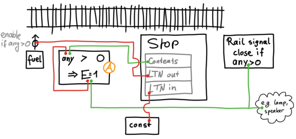

# LTN stations

Features

- Megabase tested
- Safety
- Convenience
- Explanations
- Low config effort

## I am impatient give me the blueprints

- [Github](blueprints/ltn-stations)
- [Factorio Prints](https://factorioprints.com/view/-Nf5xiUNBer2y8tMgTeh)

## Provider

Features:

- Multi-material capable with a tiny material-dependent tweak
- Supports partial loading of trains

Details:

- The red circuit does two main things. Via
  the const combinator, it configures the LTN parameters such as maximum train
  length, described in detail below. Since it is also connected to the chests,
  it reads (and adds up) items available at this station and reports it to LTN,
  both via the connection to the `LTN in` lamp.

- (A) The green circuit ensures two things: Only load the requested
  material, and only load the requested amount.

  It does this by summing up the negated train contents and the requested amount
  provided by the LTN output. The result is the number of items still missing
  from the train. This is then sent to the inserters which have their _set
  filters_ option set; they will thus only load the requested material (useful
  if you have mixed chests, by design or by mistake), and they will stop loading
  once the requested amount has been loaded, allowing for partial fills.

  > Why a times-minus-one combinator instead of simply using subtraction?

  There is no subtraction combinator that can subtract _each from green from
  each of red_, which is what we need here. Joining the negated version of one
  input with the other one is how that’s done in Factorio.

- (B) The const combinator will be filled
  with a number of settings that repeat for most LTN stations. I will refer to
  this list in the other stops’ descriptions.

  

  -  Encodes the LTN networks this stop belongs
    to. You will only need this if you plan on having certain trains only serve
    certain stops, which is most likely never going to be the case. Still, if
    you omit it, the stop will be part of every network, so if you do change
    your mind at any point, it will be super painful. Adding a second network is
    much easier if all old stations are already marked, so my advice is to just
    put this with value 1 into your blueprints.

  - 
     Encode the length of trains that
    will be able to serve this station. Set this to e.g. 3 for
    1(locomotive)-2(cargo) trains. If you later have larger trains for
    transporting ores in bulk, you can simply give their stations other train
    length limits, and they will work happily even though they are in the same
    network.

  -  Train limit for this stop. I usually set
    this to zero in my blueprints (no limit), and then adapt it on site for
    individual stops when there isn’t much space for waiting trains. In short,
    set this to that particular stop’s max waiting line.

  -  Higher priority means this stop
    will be preferred over others. I set this to 100 in my blueprints, so that I
    can easily deprioritize stops far away (to e.g. 50), or increase the
    priority of mining sites that are almost empty so they empty faster. (100 is
    simply so I can think in terms of percent.)

  - 
     This stop is only considered
    if there is more than X units or Y stacks of the requested item, with the
    stack limit taking priority. A common setting is Y = 40 × number of cargo
    wagons, so that only full trains are requested, and X = 25k × number of
    fluid wagons for fluid stations. Lower them for smaller volume providers,
    e.g. when sending satellites, or U-235 via train. Only the stack setting
    matters for solids, but if we set the fluid limit as well we can reuse this
    constant combinator as-is for the fluid provider.

  -  This is important for multi-material
    stations. When the train is full, inserters might still have an item in
    their hands, and once the train leaves they will hold it over the tracks.
    The next train will get that item, regardless of whether it was requested or
    not, the inserter doesn’t care. Reserved slots ensure the train is not fully
    loaded so that there is still some space left for the inserters to empty
    their already filled hands into.

    For single-material stations, you can leave this away. To make a station
    multi-material capable, set this high enough so that there is enough space
    in the train for another hand of each inserter. For example, you have 1-1
    trains with 6 inserters that can carry 10 items per swing, you need to leave
    enough space for 6*10=60 items in the train. For coal stacks of 50, you
    would neeed to reserve two slots for those 60 items; for iron it would only
    be one.

## Requester

Features:
- Vanilla: multi-material capable with a small change, see details below
- Warehouse mods: multi-material capable as-is
- Will never act as provider even in freak situations
- Safe against dirty trains: only unloads items it requests

Details:

  - The red circuit configures the station.
    The request amount is the negative number of how much of each item you’d
    like to have in the stop. A typical value is two full train loads, so that
    together with the request threshold (see below) of one train load, the
    station calls for a new delivery once it contains less than one.

    Red also reads the chests’ contents.
    Since both of these parts are the same circuit, Factorio adds up their
    signals. The result is that the red wire also carries deficit signal (wanted
    minus present items) to the LTN stop.

  - The const combinator has similar settings to the provider stop:

    

  - 
    
    
     Other than some setting being for
    requester instead of provider, the other main difference to the provider
    constant combinator is the provide threshold of more than one million. This
    absurdly high value ensures that even if there is for some reason a _lot_ of
    cargo in the unloading buffer chests, the station will still not act as a
    provider, and call trains to pick up its cargo.

  - (A) automatically sets filters for the
    train unloading inserters. If for whatever reason a dirty train (i.e. with
    unwanted cargo) arrives, they won’t unload it, preventing downstream item
    pollution.

  - To support multiple materials with vanilla chests, you can simply delete the
    green (auto-filter) circuit, and set the inserter filters manually. If
    you’re using e.g. a warehouse mod where you’re unloading into a single
    chest-like entity anyway, no change is necessary, and multi-material simply
    works out of the box.

## Depot

Features:

- Dirty trains (still have leftover cargo) are stopped in place
- Don’t put fuel into improperly stopped trains

Explanation:

- The memory cell (A) switches to `E=1` whenever a
  stopped train has any cargo left in it via its green connection to the train stop. This signal is then used
  to close the rail signal directly after the station, stopping the train
  indefinitely. The signal can also be used to e.g. turn a lamp red or trigger a
  programmable speaker.

  If this happens, you’ll still have to go to the train manually to empty it,
  and then reset the memory cell by briefly switching it to less-than instead of
  greater-than, but the train will not pollute your network with unwanted items.

  > Why not wire the train content signal to the rail signal directly?

  This will not stop the train, it can still move out of the station for a few
  millimeters. The train does not count as stopped at the station anymore, the
  contents are not read, and the signal switches to green. In other words,
  without the memory cell the rail signal does nothing.

- If a train stops halfway out of your station (e.g. when a rail signal right
  after the stop turns red), the train might stop with a cargo wagon adjacent to
  the fuel inserter, which will happily go to town making the freshly leaving
  train dirty. To avoid this, the inserter is only enabled if the LTN station
  says a train is stopped via the red wire.
  (We can’t use the main train stop’s signals, because that would trigger the
  emergency stopping mechanism from above.)

- The const combinator sports three signals via another red wire,

  

  -  to mark the station a depot
  -  (see provider station why setting a prio is a good idea)
  -  (see provider station as well)

## Fluid provider

Features:

- Multi-fluid capable
- Pump filters have to be set manually!
- Supports partial loads

Details:

- This one works pretty much like the solid provider. The main difference is
  that, unlike for inserters, we can’t set the filters for pumps automatically,
  so this has to be done by hand.

  Again, the red wire configures the stop,
  and reports the current tank content to the LTN network.

  Consider adding a reminder to set the filters into your blueprint, e.g. a
  speaker sounding an alert.

- The constant combinator is exactly like for solids,

  

- LTN automatically takes care of requesting fluid trains when handling fluids.
  There is no need for a _call one with a fluid wagon from the depot_ signal.

- Like for solids, the negation combinator subtracts the train’s current
  contents from what is requested via the green wire. If the train is (potentially only partial) full,
  the pumps are disabled, and the train can leave.

- Because both solid and fluid provider stations are very similar, combining
  them into a solid-and-fluid provider station is fairly straightforward.

## Fluid Requester

Features:

- Multi-fluid capable as drawn
- Resistant against dirty trains
- Pump filters have to be set manually!

Details:

- The constant combinator is exactly like for solids, except that you’ll be
  requesting fluid materials on the red
  circuit.

  

- Removing the green wire makes the station
  even simpler, allowing only one fluid in that case. However, this has the
  unfortunate side-effect that in the unlikely event where the station is
  completely empty and a dirty train arrives, it would unload the wrong fluid
  into the tanks.

  Consider adding a reminder to set the filters into your blueprint, e.g. a
  speaker sounding an alert.

- Because both solid and fluid requester stations are very similar, combining
  them into a solid-and-fluid requester station is fairly straightforward.
